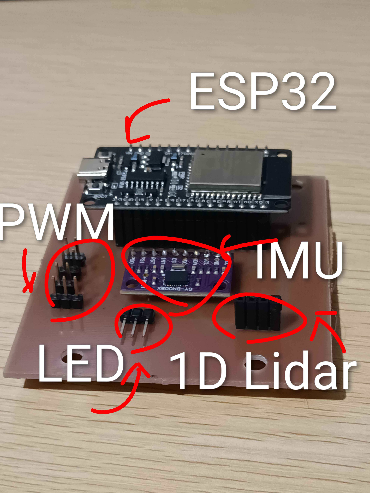
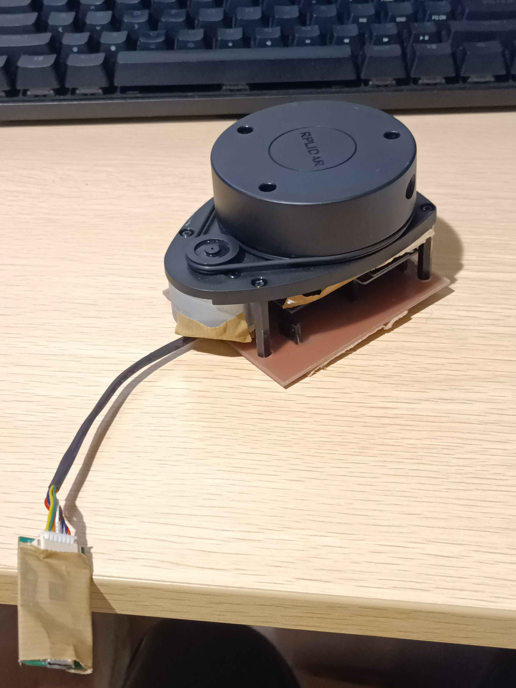
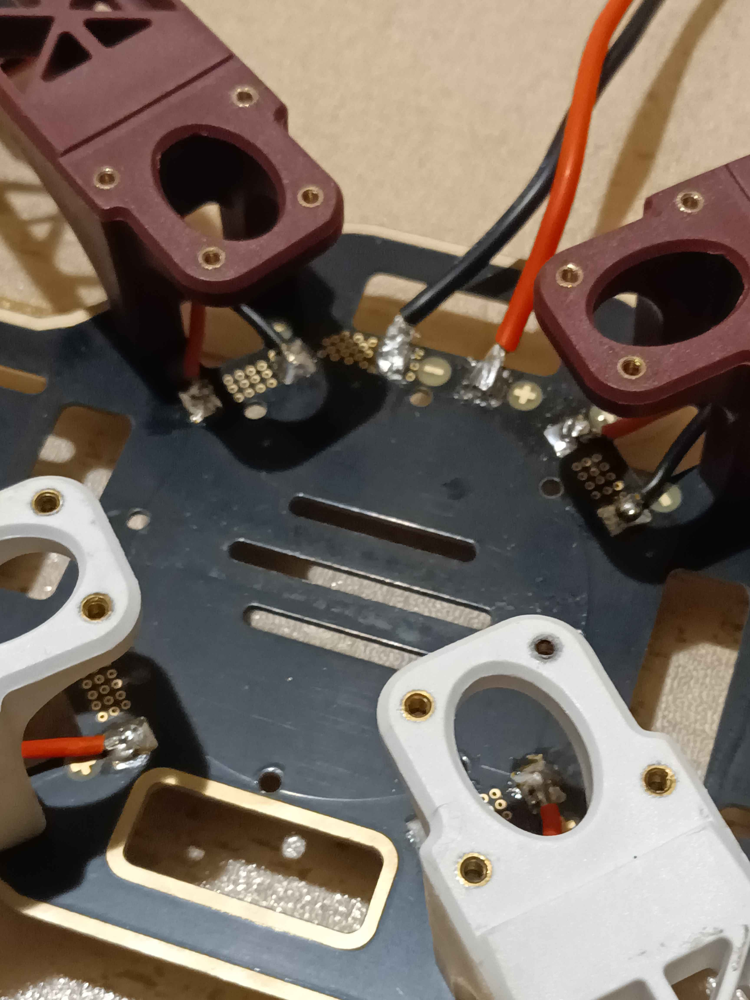

# 自作ドローン

## 概要
このプロジェクトは、自作ドローンの設計・製作・制御を目的としています。各種パーツの選定、組み立て、プログラムによる制御方法についてまとめています。

---

## 📝 目次

* [特徴](#-特徴)
* [外観](#-外観)
* [飛行映像](#-飛行映像)
* [操作方法](#-操作方法)
* [ハード構成](#-ハード構成)
* [インストール](#-インストール)
* [ディレクトリ構成](#-ディレクトリ構成)
* [使い方](#-使い方)
* [参考文献](#-参考文献)

---

## ✨ 特徴

* 自作のドローンファームウェア
* 拡張可能なハードウェア構成

---
## 📷️ 外観


---

## 📹️ 飛行映像
https://github.com/user-attachments/assets/ef20d2a3-a51d-4bfe-b37a-9de0bfae4551

---

## 🎮️ 操作方法
PlayStation5のコントローラを使用して飛ばすことができます。  
左スティックの上下で上昇、降下、右スティックの前後左右で前進、後退、左右移動ができます。  
R,Lボタンで向きを変更できます。  
バツボタンでセンサのキャリブレーションを行い、丸ボタンでモータの回転のオンオフができます。

---

## 🤖 ハード構成
* 制御マイコン: ESP32-WROOM-32D
* コントローラー: PlayStation5 DualSense--

* フレーム: DJI F450
* モーター: BLDC 2212 920kv * 4
* ESC: 20A (最大30A 10秒) * 4
* プロペラ: 10✕4.5 inch * 4
* バッテリー: 4S lipo 5000mAh 100C (3S lipo 2250mAh 60C程度なら満充電で1分程度飛行可能)
* ランディングギア: F450対応のもの
* LEDテープ: SK6812 * 21 (neopixel対応のものなら可) 
### 拡張用
* RaspberryPi4 4GB(RaspberryPi5 8GBはモバイルバッテリー運用は厳しい)
* モバイルバッテリー: 5V3A出力できるものなら可
* 2d lidar: rplidar a1m8

--- 
## 📦 インストール

```bash
# リポジトリをクローン
git clone https://github.com/st20080625/Drone.git

# ディレクトリに移動
cd Drone
```

---


## 📁 ディレクトリ構成

```
Drone/
├── README.md
├── images
├── include                     # ESP32フライトコントローラ用のヘッダ
├── lib                         # ps5コントローラを使うためのライブラリ
├── models                      # 3dプリンタで印刷するようのデータ
├── pcb                         # 回路図,基盤データ
├── platformio.ini              # build定義
├── recv_imu_test               # データ送信テスト
├── slam_raspi                  # マップを作るためのraspi用の環境
├── src                         # ESP32フライトコントローラの実装
```
---

## 🚀 使い方

```bash
# まずはじめにplatformioをインストールします。
pip install platformio

# 次に、src/main.cppのps5.begin(~)の~を使用するコントローラーのmacアドレスに書き換えてください。

# 次にesp32をパソコンに接続し,以下のコマンドを入力します。
# これはプロジェクトのルートディレクトリで行ってください。
platformio run --target upload

# buildとesp32に書き込みが行われます。
```

ドローンの組み立て手順や仕組みを記載します。 

ドローンの飛行を制御するには制御を行うための基盤が必要です。
kicadを使用してpcb/の中にあるdrone.kicad_proを開いて回路図とpcbを確認してください。ガーバーファイルとドリルファイルを出力し、JLCPCBなどにデータを送り、印刷してもらうか,自分でユニバーサル基板に実装するなどをして作成してください。既存ボードを刺す形式なので、使用する基盤とピン配置があっているかを確認して、異なっていれば修正してください。
基盤を固定するためにmodels/の中にあるlidar_mount.stl(追加予定)を印刷し、pcbと固定してください。
その後、f450フレームの上部プレートにネジでmount経由で固定してください。ダブルナットにすれば緩みにくくなると思います。
基盤を作成するとこのようになると思います。

 

これはバージョンが古いので1d lidarの配置が変わっていると思いますが、このlidarは現在は使っていないのでなくても大丈夫です。  
2dのlidarを使って環境マップを作成したい場合は印刷したmountと、pcbの穴の位置が合うように無理やり合わせ、下面にワッシャーをはさみ、lidarについている足をm2.6ネジで固定してください。

2d lidarを取り付けると次のようになると思います。  

  
  

次にf450にescとバッテリーをつなぐためのケーブルをはんだづけします。バッテリーととなぐケーブルはxt60のメス(使用するバッテリーによる)がついていればよいです。  
はんだ付けをすると次のようになります。

  
  
はんだ付けが終わったら上部のプレートに3dプリンタで作ったら上部プレートを取り付けて機体は完成です。

あとはモータとプロペラ、バッテリーを固定して最低限の飛行できる状態になります。

raspberrypiなどを乗せる説明は現状では省略します。
### 飛行原理
ドローンはプロペラを回転させることにより空気の流れを変え、揚力を生み出して浮上します。  
そのため、モータとプロペラ、回転方向の組み合わせが正しくないと飛ぶことはできません。  

              ↑ 前方
              ↑
               |
     M2(CW)       M1(CCW)
         ↻             ↺ 
           \         /
            \_______/
            /       \
         ↺              ↻
     M3(CCW)        M4(CW)
                |
                ↓ 後方
モーターは上記の回転方向になることを前提としてプログラムは書かれています。  
また、プロペラは右回転用と左回転用の２種類あり、モータの回転とあっていないと下向きに力が加わることになります。

#### 上昇

上昇する際はすべてのモータの出力を上げることで、下向きの気流が強くなり、機体に上向きの揚力が働きます。
これによりドローンは上昇します。

#### 降下

降下は上昇の逆で、すべてのモータの出力を下げることで、揚力が減少し、重力により機体がゆっくりと下降します。
モータの回転を完全に止めると急降下してしまうため、少し出力を残してバランスを取りながら降下します。

#### 前進

前方に傾くように、後方（M3・M4）のモータ出力をわずかに上げ、前方（M1・M2）の出力を下げます。
機体の推力ベクトルが前方向に傾くことで、前進運動が発生します。

       ↑ 前方
        \
         \  → 進行方向
          \
     M2(CW)       M1(CCW)
         ↻             ↺ 
           \         /
            \_______/
            /       \
         ↺              ↻
     M3(CCW)        M4(CW)

#### 後退

後退は前進の逆で、前方（M1・M2）のモータ出力を上げ、後方（M3・M4）を下げます。
これにより推力ベクトルが後ろに傾き、ドローンが後退します。

#### 左右移動

前進、後退と同様にして可能です。

#### ヨー回転（Yaw Rotation）

ドローンはプロペラの回転による**反トルク（逆方向の力）**を利用して機体を回転させます。
機体上から見たとき、モーター配置と回転方向は以下のようになっています：

              ↑ 前方
              ↑
               |
     M2(CW)         M1(CCW)
         ↻               ↺ 
           \           /
            \_________/
            /         \
         ↺               ↻
     M3(CCW)         M4(CW)
               |
               ↓ 後方

▶ 右旋回（時計回り：Yaw Right）

右に機首を向けたい場合（機体を時計回りに回したい場合）は、
CCWモータ（M1・M3）の出力を上げ、CWモータ（M2・M4）の出力を下げます。
これにより反トルクが時計回り方向に働き、機体が右に回転します。

       ↑ 前方
        \
         \  機体回転 →（右旋回：時計回り）
          \
     M2(CW)↓         ↑M1(CCW)
         ↻               ↺ 
           \           /
            \_________/
            /         \
         ↺               ↻
     M3(CCW)↑         ↓M4(CW)

◀ 左旋回（反時計回り：Yaw Left）

左に機首を向けたい場合（機体を反時計回りに回したい場合）は、
CWモータ（M2・M4）の出力を上げ、CCWモータ（M1・M3）の出力を下げます。
これにより反トルクが反時計回り方向に働き、機体が左に回転します。

       ↑ 前方
        /
       /  ← 機体回転（左旋回：反時計回り）
      /
     M2(CW)↑         ↓M1(CCW)
         ↻               ↺ 
           \           /
            \_________/
            /         \
         ↺               ↻
     M3(CCW)↓         ↑M4(CW)


このように、ドローンは4つのモータの出力バランスを変化させることで、
反トルクを利用してヨー方向の回転（機首の向き）を制御しています。

#### 制御方法
制御方法は単純でコントローラーの入力から姿勢を決定し、オイラー角表現からクォータニオン表現に変換し,imuから取得したクォータニオンとの誤差クォータニオンからトルクを取得し、PID制御で反転させて一致するようにしています。(P)  
角速度を反転させてゲイン調整して加算することで応答性を調整しています。(D)  
誤差の蓄積でドローンが滑って行くことがあるのでそれをできるだけ防ぐようにroll、pitchに対しては誤差の積分を加算して元に戻すようにしています。(I)  
地上の制御と違い地面から浮くのでPIDゲインの調整は難しかったです。  
PとDを調整するときに調整するゲイン以外を0にしてそれぞれで安定させてから、どちらも有効にして飛ばすと結構楽に飛ぶようになりました。

## 参考文献

* Emil Fresk & George Nikolakopoulos (2013). *Full Quaternion Based Attitude Control for a Quadrotor*.  
  European Control Conference (ECC), Zurich, Switzerland, July 17–19, 2013.  
  IEEE. DOI: [10.23919/ECC.2013.6669617](https://doi.org/10.23919/ECC.2013.6669617)  
  PDF（オープンアクセス）: [DiVA Portal](https://www.diva-portal.org/smash/get/diva2:1010947/FULLTEXT01.pdf)
* mebiusbox. *CGのための数学*.  
  クォータニオン章（オンライン）: [https://zenn.dev/mebiusbox/books/132b654aa02124/viewer/2966c7](https://zenn.dev/mebiusbox/books/132b654aa02124/viewer/2966c7)


---
