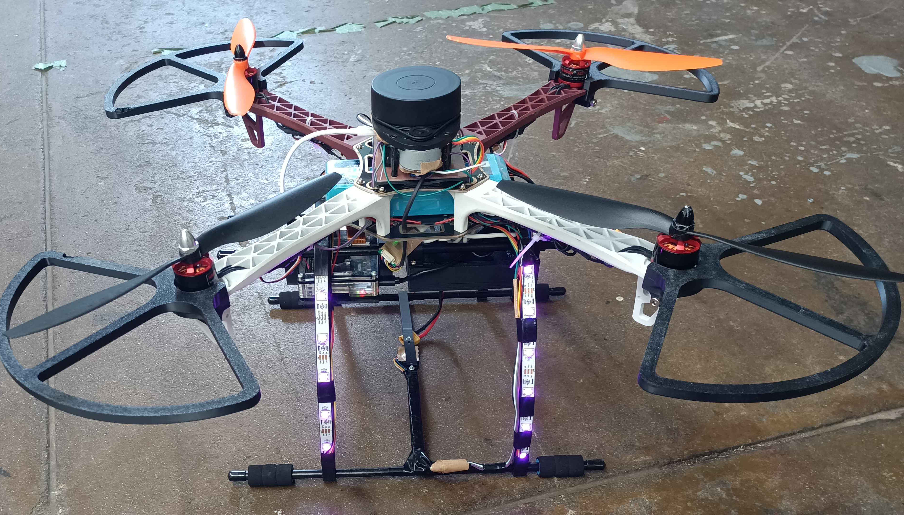

# 自作ドローン

## 概要

このプロジェクトは、自作ドローンの設計・製作・制御を目的としています。各種パーツの選定、組み立て、プログラムによる制御方法についてまとめています。

---

## 📝 目次

* [特徴](#-特徴)
* [外観](#-外観)
* [飛行映像](#-飛行映像)
* [ハード構成](#ハード構成)
* [インストール](#-インストール)
* [ディレクトリ構成](#-ディレクトリ構成)
* [使い方](#-使い方)
* [貢献](#-貢献)
* [ライセンス](#-ライセンス)

---

## ✨ 特徴

* 自作のドローンファームウェア
* 2d lidarで環境マップの作成
* 拡張可能なハードウェア構成

---
## 外観


---

## 飛行映像
[](https://raw.githubusercontent.com/st20080625/Drone/video/drone.mp4)

---

## ハード構成
* 制御マイコン: ESP32-WROOM-32D
* コントローラー: PlayStation5 DualSense--

* フレーム: DJI F450
* モーター: BLDC 2212 920kv * 4
* ESC: 20A (最大30A 10秒) * 4
* プロペラ: 10✕4.5 inch * 4
* バッテリー: 4S lipo 5000mAh 100C (3S lipo 2250mAh 60C程度なら満充電で1分程度飛行可能)
* ランディングギア: F450対応のもの
* LEDテープ: SK6812 * 21 (neopixel対応のものなら可) 
### 拡張用
* RaspberryPi4 4GB(RaspberryPi5 8GBはモバイルバッテリー運用は厳しい)
* モバイルバッテリー: 5V3A出力できるものなら可
* 2d lidar: rplidar a1m8
## 📦 インストール

```bash
# リポジトリをクローン
git clone https://github.com/st20080625/Drone.git

# ディレクトリに移動
cd Drone
```

---


## 📁 ディレクトリ構成

```
Drone_esp32/
├── README.md
├── drone                       # 回路図,基盤データ
├── images
├── include                     # ESP32フライトコントローラ用のヘッダ
├── lib                         # ps5コントローラを使うためのライブラリ
├── platformio.ini              # build定義
├── recv_imu_test               # データ送信テスト
├── slam_raspi                  # マップを作るためのraspi用の環境
├── src                         # ESP32フライトコントローラの実装
└── video
```
---

## 🚀 使い方

```bash
# まずはじめにplatformioをインストールします。
pip install platformio

# 次に、src/main.cppのps5.begin(~)の~を使用するコントローラーのmacアドレスに書き換えてください。

# 次にesp32をパソコンに接続し,以下のコマンドを入力します。
platformio run --target upload

# buildとesp32に書き込みが行われる
```

ドローンの組み立て手順や制御プログラムの設定方法を詳しく記載します。

---

## 📄 ライセンス

このプロジェクトは [MIT License](LICENSE) のもとで公開されています。

---

## 💬 作者

**あなたの名前**

* 🌐 ウェブサイト: [URL]
* 📧 メール: [メールアドレス]
* 🐙 GitHub: [プロフィールURL]
